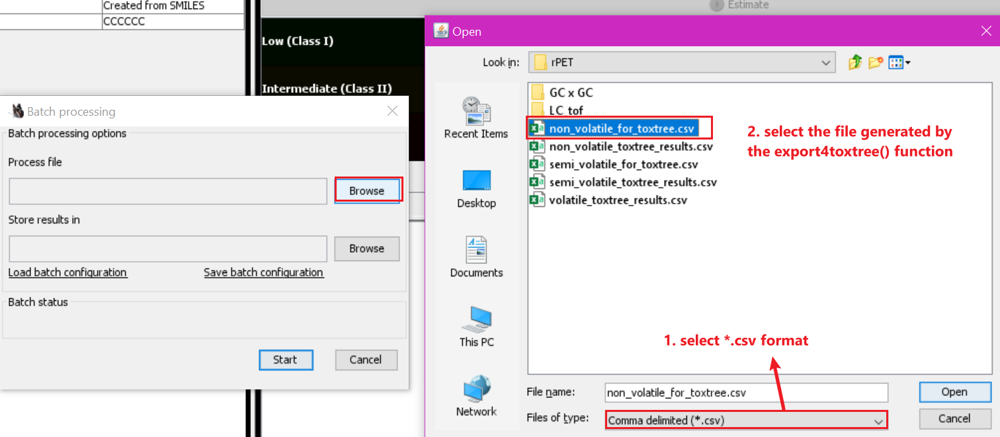

fcmsafety
================

true

<!-- README.md is generated from README.Rmd. Please edit that file -->
<!-- badges: start -->
<!-- badges: end -->

# Introduction

The goal of fcmsafety is to assign toxicity levels for compounds from
food contact materials. It takes into account the toxicity data from: 1.
Substances of Very High Concern (SVHC) from ECHA
(<https://echa.europa.eu/candidate-list-table>); 2. Carcinogenic,
Mutagenic, and Reprotoxic (CMR) from the Classification, Labelling, and
Packaging (CLP) regulation
(<https://echa.europa.eu/information-on-chemicals/annex-vi-to-clp>) ; 3.
Carcinogenic substances from IARC
(<https://monographs.iarc.who.int/list-of-classifications>); 4.
Endocrine Disrupting Chemicals (EDC) from The International Panel on
Chemical Pollution (IPCP) commissioned by UN Environment
(<https://www.unep.org/explore-topics/chemicals-waste/what-we-do/emerging-issues/scientific-knowledge-endocrine-disrupting>);
5. Specific Migration Limit (SML) from EU 10/2011 regulation
(<https://eur-lex.europa.eu/legal-content/EN/TXT/HTML/?uri=CELEX:02011R0010-20200923&qid=1636402301680&from=en>)
6. Specific Migration Limit (SML) from China GB 9685 regulation
(Provided by IQTC).

The toxicity level assignment follows the rules listed in the
inst/toxicity_levels.png (don’t know why it is not rendered in this
readme file)

Please bear in mind that the toxicity level assignment here is on the
basis of individual compounds, whilst substances listed in the
aforementioned databases could be groups of compounds. These groups of
substances will not be considered as they not are specific in terms of
chemical structures and no “InChIKey” can be retrieved from Pubchem,
which is used for matching. For example, nonylphenols are a family of
closely related organic compounds composed of phenol bearing a 9
carbon-tail, and they could be overlooked unless any database has
numerated some specific structures in their lists.

# Installation

You can install the development version of fcmsafety from
[GitHub](https://github.com/) with the code listed below.

``` r
install.packages("remotes")
remotes::install_github("QizhiSu/fcmsafety")
```

# Load required packages

``` r
library(fcmsafety)
library(dplyr)
```

# Update and Load databases

You have to first update all the databases and load them into the global
environment.

``` r
# You don't have to update all the databases as we have prepared them (updated 
# on 2021/11/11) and can be used directly. In case you want to have the latest 
# databases (if you find any update of these databases after 2021/11/11), please
# run update_databases(), it might take long time as retrieving meta data for 
# all these databases is time-consuming.
update_databases()

# If you have updated the databases yourself, please run:
load_databases(use_default = FALSE)
# Otherwise
load_databases()
```

# Process your data

## Read in your data

``` r
# Please enter the path of your data, e.g., "D:/my data/mydata.xlsx".
data <- rio::import("D:/my data/mydata.xlsx")
```

Given that your data have at least SMILES and CAS numbers, you can use
the following code to process your data. Otherwise, you need to firstly
extract metadata from Pubchem using the
[***labtools***](https://github.com/QizhiSu/labtools).

## Export file for Toxtree

For compounds that do not present in any of the databases we consider
here, we can use Toxtree (<http://toxtree.sourceforge.net/>) to predict
its Cramer rules level which will be used for assigning toxicity level
in the following step. We now can export a file that can be used by
Toxtree for batch processing.

``` r
# This code will generate a file name "for_toxtree.csv"
export4toxtree(data, cas_col = 1, name_col = 2)
# Of course, you can also specify the path and name of the output file
export4toxtree(data, cas_col = 1, name_col = 2, output = "D:/data/mydata_for_toxtree.csv")
```

## Toxtree batch processing

    {width=500px}

    {width=500px}

    {width=500px}

Normally, this step is quite fast, but we noticed that polyethylene
glycols might take quite long time.

## Assign toxicity

This step requires the results from Toxtree (assuming you have the
result in “D:/data/mydata_toxtree_results.csv”).

``` r
data_complete <- data %>% 
  assign_toxicity(toxtree_result = "D:/data/mydata_toxtree_results.csv")
```

## Export results

``` r
rio::export(data_complete, "D:/data/mydata_result.xlsx")
```
